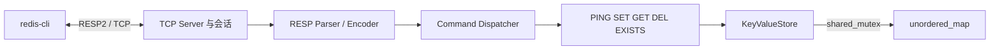

# Mini Redis 架构设计

## 分层架构

- `server`：WinSock2 生命周期、监听、客户端会话与固定线程池。
- `protocol`：增量解析 RESP2，请求和响应字节转换。
- `commands`：命令名规范化、参数校验和业务语义。
- `storage`：String 键值数据及多读单写并发控制。
- `common`：跨模块响应类型。

## 数据流

会话把收到的字节追加到私有缓冲区。解析器返回“完整、不完整、协议错误”三种状态；完整请求交给分发器，结果编码后写回。缓冲区中剩余字节继续解析，从而处理粘包；不完整数据保留到下一次 `recv`，从而处理半包。

## 核心接口

- `RespParser::parse(bytes)`：返回解析状态、命令、消费字节数和错误原因。
- `encode(result)`：生成 RESP2 服务端响应。
- `CommandDispatcher::execute(request)`：执行与 Socket 无关的命令。
- `KeyValueStore`：提供 `set`、`get`、`erase`、`count_existing`。
- `TcpServer::run()`：监听并处理客户端；`stop()` 关闭监听 Socket。

## 并发策略

主线程负责 `accept`，固定线程池处理连接。连接缓冲区互不共享；存储层 `GET/EXISTS` 使用共享锁，`SET/DEL` 使用独占锁。首版保证单条命令线程安全，不提供跨命令事务。

## 错误策略

未知命令或参数错误返回 `-ERR` 并保持连接；无法恢复的 RESP 错误或请求超限返回错误并关闭当前连接；工作线程边界捕获异常，避免影响其他连接。

