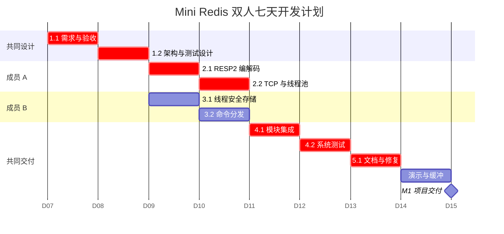
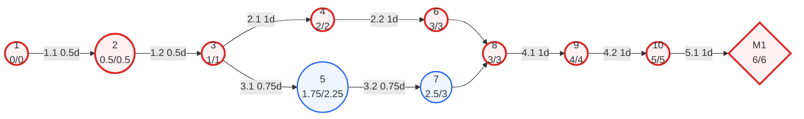

# Mini Redis 项目管理计划

本文保留原定双人七天计划，图中的 2026-09-07 起始日期是排期基线，并非实际执行时间。实际开发与测试已提前开展，当前验收状态以 [测试报告](reports/2026-09-06-test-report.md) 为准；未据此虚构成员实际工时。

## WBS 与双人分工

| WBS | 工作 | 负责人 | 工期 | 前置 |
|---|---|---|---:|---|
| 1.1 | 需求分析与验收标准 | 共同 | 0.5d | — |
| 1.2 | 架构、接口与测试设计 | 共同 | 0.5d | 1.1 |
| 2.1 | RESP2 编解码 | A | 1d | 1.2 |
| 2.2 | TCP 服务与线程池 | A | 1d | 2.1 |
| 3.1 | 线程安全存储 | B | 0.75d | 1.2 |
| 3.2 | 命令分发与处理 | B | 0.75d | 3.1 |
| 4.1 | 模块集成 | 共同 | 1d | 2.2、3.2 |
| 4.2 | 系统与并发测试 | 共同 | 1d | 4.1 |
| 5.1 | 文档、验收与修复 | 共同 | 1d | 4.2 |
| M1 | 演示、打包与缓冲 | 共同 | 1d | 5.1 |

## Gantt 图

`4.1` 同时依赖成员 A 与 B 两条分支；Gantt 使用较晚完成的 A 分支定位，双依赖由 PERT 表达。

## PERT/CPM 图

关键路径为 `1.1 → 1.2 → 2.1 → 2.2 → 4.1 → 4.2 → 5.1`，长度 6 天；成员 B 分支总时差 0.5 天，第 7 天为交付缓冲。

## 主要风险

- RESP 半包/粘包：先写增量解析测试，再接入 Socket。
- 接口不一致：第 1 天冻结请求、结果和存储接口。
- 功能蔓延：首版只接受五个命令和 String。
- 并发错误：存储层集中加锁并重复运行并发测试。
- 文档失真：交付前按需求编号逐项复核。
