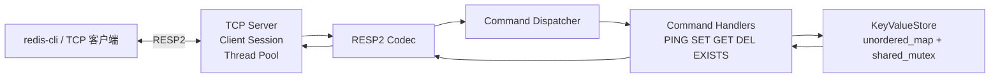
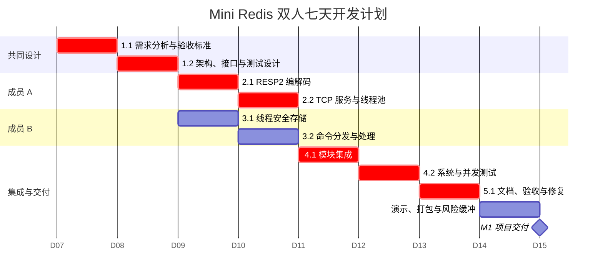
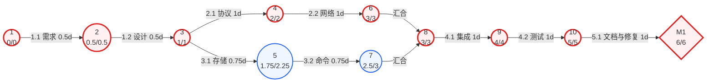

# Mini Redis 系统设计规格说明书

> 原始设计基线。实际实现与执行结果请结合 [架构设计](../../architecture.md) 和 [正式测试报告](../../reports/2026-09-06-test-report.md) 阅读；计划和设计描述不等于已经验收通过。

## 1. 文档信息

| 项目   | 内容                               |
| ---- | -------------------------------- |
| 项目名称 | Mini Redis——基于 C++20 的轻量级内存键值数据库 |
| 项目性质 | 软件工程课程项目、系统软件原型                  |
| 开发人数 | 2 人                              |
| 计划周期 | 7 天                              |
| 文档版本 | 1.0                              |
| 编制日期 | 2026-09-04                       |

## 2. 项目背景与目标

Redis 是典型的内存键值数据库，涉及网络通信、应用层协议、命令解释、并发控制和内存数据管理等系统软件知识。本项目以教学和演示为目的，实现一个可由 `redis-cli` 连接的 Mini Redis 骨架。

首版不追求与 Redis 完全兼容，也不以生产部署为目标。项目成功标准是：在一周内形成结构清晰、可编译、可运行、可测试、可继续扩展的软件原型，并留下完整的软件工程过程文档。

## 3. 可行性分析

### 3.1 技术可行性

- C++20 标准库提供 Socket 之外所需的容器、线程、互斥锁和字符串处理能力。
- 网络层使用操作系统 TCP Socket；构建系统采用 CMake。
- 首版验收平台确定为 Windows 10/11 x64、Visual Studio 2022（MSVC）和 WinSock2；网络接口保留平台适配边界，Linux/POSIX Socket 作为后续迭代。
- 测试采用 CTest 驱动的小型测试可执行文件，首版不引入需要联网下载的第三方测试框架。
- 首版只实现 RESP2 中 Array、Bulk String 以及服务端常用响应类型，协议工作量可控。
- 首版只支持 String 数据类型和五个命令，能够在 7 天内完成端到端链路。

### 3.2 进度可行性

两名成员分别承担“网络与协议”和“命令与存储”两条并行工作流，第 4 天开始集成，第 5—6 天完成测试和文档，第 7 天用于演示、打包和风险缓冲。

### 3.3 操作可行性

用户无需安装专用客户端，可通过官方 `redis-cli` 连接。项目通过 README 提供统一的构建、启动、测试和演示命令。

## 4. 项目范围

### 4.1 首版范围

- C++20 与 CMake 项目骨架。
- TCP 服务端和固定大小线程池。
- RESP2 子集的增量解码和响应编码。
- `PING`、`SET`、`GET`、`DEL`、`EXISTS` 五个命令。
- 基于 `std::unordered_map<std::string, std::string>` 的内存存储。
- 使用 `std::shared_mutex` 实现多读单写并发控制。
- RESP、存储和命令层单元测试，以及 `redis-cli` 端到端验收测试。

### 4.2 后续迭代

- 第二阶段：`EXPIRE`、`TTL` 和过期键清理。
- 第三阶段：AOF 持久化和启动恢复。
- 第四阶段：Hash、List、Set 等数据结构。
- 第五阶段：非阻塞 I/O、Reactor 模型、性能基准与监控指标。

### 4.3 非目标

首版不实现集群、主从复制、事务、Lua 脚本、发布订阅、完整 RESP2/RESP3、访问控制和生产级容灾。

## 5. 需求分析

### 5.1 参与者

| 参与者     | 职责                       |
| ------- | ------------------------ |
| 普通客户端   | 连接服务端并执行受支持的 Redis 命令    |
| 开发/运维人员 | 构建、启动、停止、测试并查看日志         |
| 课程验收人员  | 按 README 复现系统并检查功能、结构和文档 |

### 5.2 功能需求

| 编号    | 需求                              | 验收条件                                |
| ----- | ------------------------------- | ----------------------------------- |
| FR-01 | 服务端监听配置端口并接受多个 TCP 客户端          | 两个客户端可同时建立连接并执行命令                   |
| FR-02 | 解析 RESP2 Array 与 Bulk String 请求 | 能正确处理 `redis-cli` 发送的五种首版命令         |
| FR-03 | 支持 `PING [message]`             | 无参数返回 `PONG`，有参数返回原消息               |
| FR-04 | 支持 `SET key value`              | 返回 `OK`，随后 `GET key` 可取得该值          |
| FR-05 | 支持 `GET key`                    | 存在时返回值，不存在时返回 RESP Null Bulk String |
| FR-06 | 支持 `DEL key [key ...]`          | 删除一个或多个键并返回实际删除数量                   |
| FR-07 | 支持 `EXISTS key [key ...]`       | 返回所给键中存在的键数量                        |
| FR-08 | 对未知命令和错误参数返回规范错误                | 返回 `-ERR`，且连接保持可用                   |
| FR-09 | 支持优雅停止                          | 收到停止信号后停止接收新连接并释放资源                 |

### 5.3 非功能需求

| 编号     | 质量属性 | 要求                                                       |
| ------ | ---- | -------------------------------------------------------- |
| NFR-01 | 可移植性 | 首版在 Windows 10/11 x64 + MSVC 2022 验收；平台 Socket 差异只存在于网络层 |
| NFR-02 | 并发性  | 存储层支持并发读取，并保证写入和删除互斥                                     |
| NFR-03 | 可靠性  | 单个连接的协议或 Socket 错误不得导致服务进程崩溃                             |
| NFR-04 | 安全性  | 单条请求和参数长度设置上限，拒绝畸形或超限输入                                  |
| NFR-05 | 可测试性 | 协议、存储和命令层不依赖真实 Socket 即可单元测试                             |
| NFR-06 | 可维护性 | 模块单一职责，公共接口有注释，不在命令层直接操作 Socket                          |
| NFR-07 | 可复现性 | 全新环境可按 README 完成配置、构建、测试和运行                              |

## 6. 用例设计

### UC-01 设置并读取键值

- 前置条件：服务已启动，客户端已建立连接。
- 主成功场景：客户端发送 `SET course software-engineering`；服务返回 `OK`；客户端发送 `GET course`；服务返回 `software-engineering`。
- 异常场景：参数数量错误时返回 `ERR wrong number of arguments`，连接保持可用。

### UC-02 删除和检查键

- 前置条件：服务中可能存在目标键。
- 主成功场景：客户端执行 `EXISTS key1 key2` 获取存在数量；执行 `DEL key1 key2` 获取实际删除数量。
- 后置条件：被删除的键无法再由 `GET` 取得。

### UC-03 处理非法请求

- 前置条件：客户端已建立连接。
- 主场景：未知命令或错误参数返回 `-ERR`，后续合法命令仍可执行。
- 协议错误场景：RESP 帧无法恢复解析时返回 `-ERR Protocol error`，随后关闭该连接。

## 7. 总体架构

系统采用分层单体架构和固定线程池。网络层只负责连接与字节流，协议层负责 RESP2 值与字节之间的转换，命令层负责参数校验和业务语义，存储层负责线程安全的数据访问。



### 7.1 模块职责

| 模块         | 职责                       | 依赖                             |
| ---------- | ------------------------ | ------------------------------ |
| `server`   | 监听端口、管理连接、提交会话任务、优雅停止    | `protocol`、`commands`、`common` |
| `protocol` | 增量解析 RESP 请求并编码响应        | `common`                       |
| `commands` | 命令注册、名称规范化、参数检查、业务处理     | `storage`、`protocol`           |
| `storage`  | String 键值的查询、写入、删除和存在性检查 | C++ 标准库                        |
| `common`   | 配置、日志、错误类型和共享常量          | C++ 标准库                        |

### 7.2 请求数据流

1. `TcpServer` 接受连接并将客户端会话提交到固定线程池。
2. `ClientSession` 循环读取字节，将数据追加到连接私有缓冲区。
3. `RespParser` 从缓冲区解析完整命令；数据不完整时保留缓冲并继续读取。
4. `CommandDispatcher` 规范化命令名、查找处理器并校验参数数量。
5. 处理器调用 `KeyValueStore`，得到与网络无关的业务结果。
6. `RespEncoder` 将结果编码后写回客户端；会话继续等待下一条命令。

## 8. 接口与数据设计

### 8.1 协议子集

客户端请求支持 RESP2 Array 和 Bulk String，例如：

```text
*3\r\n$3\r\nSET\r\n$4\r\nname\r\n$5\r\nAlice\r\n
```

服务端响应支持 Simple String、Error、Integer、Bulk String 和 Null Bulk String。

### 8.2 主要接口

```cpp
struct CommandRequest {
    std::vector<std::string> arguments;
};

using CommandResult = std::variant<SimpleString, ErrorString, Integer, BulkString, NullBulkString>;

class RespParser {
public:
    ParseResult parse(std::string_view bytes);
};

class KeyValueStore {
public:
    void set(std::string key, std::string value);
    std::optional<std::string> get(std::string_view key) const;
    std::size_t erase(std::span<const std::string> keys);
    std::size_t countExisting(std::span<const std::string> keys) const;
};

class CommandDispatcher {
public:
    CommandResult execute(const CommandRequest& request);
};
```

`ParseResult` 必须区分“解析成功”“输入尚不完整”和“协议错误”，避免把 TCP 半包误判为非法请求。

## 9. 并发设计

- 主线程负责监听和接受连接。
- 固定线程池处理客户端会话，线程数从配置读取，默认取合理的小值。
- 每个连接拥有独立接收缓冲区，连接之间不共享协议解析状态。
- `GET` 和 `EXISTS` 获取共享锁；`SET` 和 `DEL` 获取独占锁。
- 首版不承诺多个命令组成的事务原子性，每一条命令自身是线程安全的。

## 10. 异常与边界处理

| 情况            | 处理策略                                     |
| ------------- | ---------------------------------------- |
| TCP 半包        | 保留连接缓冲区，继续读取后再解析                         |
| TCP 粘包        | 循环从缓冲区提取多条完整命令                           |
| 未知命令          | 返回 `-ERR unknown command`，连接保持           |
| 参数数量错误        | 返回 `-ERR wrong number of arguments`，连接保持 |
| RESP 协议错误     | 返回 `-ERR Protocol error`，关闭当前连接          |
| 请求或参数超限       | 返回错误并关闭当前连接，避免内存耗尽                       |
| 单连接 Socket 错误 | 记录日志并清理该会话，不影响其他连接                       |
| 工作线程异常        | 会话边界捕获并记录，禁止异常越过线程入口                     |

## 11. 测试与验收

### 11.1 测试层次

- 单元测试：RESP 完整帧、半包、粘包、畸形帧；存储增删查；五个命令及错误参数。
- 并发测试：多个线程并发执行 `SET`、`GET`、`DEL`，程序不崩溃且单命令结果符合语义。
- 集成测试：启动真实服务，通过 `redis-cli` 验证五个命令和持续连接。
- 回归测试：每次合并前运行 CTest 全量测试。

### 11.2 退出准则

- 项目可由 CMake 配置和构建，编译无错误。
- 自动化测试全部通过。
- `redis-cli` 能完成 `PING`、`SET`、`GET`、`EXISTS`、`DEL` 演示。
- 畸形请求不会导致服务进程崩溃。
- README 中的命令由另一名成员从全新构建目录复现成功。

## 12. 项目组织与配置管理

### 12.1 双人分工

| 成员   | 主责                             | 交叉评审      |
| ---- | ------------------------------ | --------- |
| 成员 A | TCP Server、客户端会话、线程池、RESP2 编解码 | 评审存储和命令测试 |
| 成员 B | KeyValueStore、命令分发、五个命令、业务测试   | 评审网络和协议测试 |
| 共同   | CMake 集成、端到端测试、文档、演示与答辩        | 合并前共同验收   |

### 12.2 版本与变更管理

- 使用 Git，主分支始终保持可构建。
- 功能分支以 `feature/` 开头，修复分支以 `fix/` 开头。
- 提交信息使用 `feat:`、`fix:`、`test:`、`docs:` 等前缀。
- 修改需求范围时记录变更原因、影响模块、工期影响和双方结论。
- 合并条件是代码评审通过且 CTest 全部通过。

## 13. 进度计划

### 13.1 Gantt 图



> 注：`4.1` 同时依赖 `2.2` 和 `3.2`。Mermaid Gantt 以较晚完成的成员 A 分支作为排程基准，PERT 图完整表达双前置关系。

### 13.2 PERT/CPM 图



- 关键路径：`1.1 → 1.2 → 2.1 → 2.2 → 4.1 → 4.2 → 5.1`。
- 关键路径长度：6 天。
- 成员 B 分支总时差：0.5 天。
- 第 7 天：演示、打包与不可预见问题缓冲，不扩大首版需求范围。

## 14. 风险管理

| 风险                | 概率  | 影响  | 应对措施                                     |
| ----------------- | --- | --- | ---------------------------------------- |
| RESP 半包/粘包解析耗时超预期 | 中   | 高   | 第 2 天先完成增量解析测试，再接入 Socket                |
| 两条分支接口不一致         | 中   | 高   | 第 1 天冻结请求、结果和存储接口；每日短会同步                 |
| 并发错误难以复现          | 中   | 中   | 存储层集中加锁；提供重复运行的并发测试                      |
| 跨平台 Socket 差异     | 低   | 中   | 首版固定使用 Windows + WinSock2 验收，平台代码封装到网络模块 |
| 功能蔓延导致延期          | 高   | 高   | 首版只接受五个命令和 String 类型；新增功能进入迭代列表          |
| 文档与实现不一致          | 中   | 中   | 第 6 天按验收表逐项复核 README、接口和命令行为             |

## 15. 目录结构

```text
mini_redis/
├── CMakeLists.txt
├── README.md
├── docs/
│   ├── requirements.md
│   ├── architecture.md
│   ├── project-plan.md
│   └── testing.md
├── include/mini_redis/
│   ├── common/
│   ├── protocol/
│   ├── storage/
│   ├── commands/
│   └── server/
├── src/
│   ├── common/
│   ├── protocol/
│   ├── storage/
│   ├── commands/
│   ├── server/
│   └── main.cpp
└── tests/
    ├── protocol/
    ├── storage/
    ├── commands/
    └── integration/
```

该结构按业务职责拆分模块，使协议、命令和存储能够独立测试，也为 TTL、AOF 和新数据结构保留稳定扩展边界。
